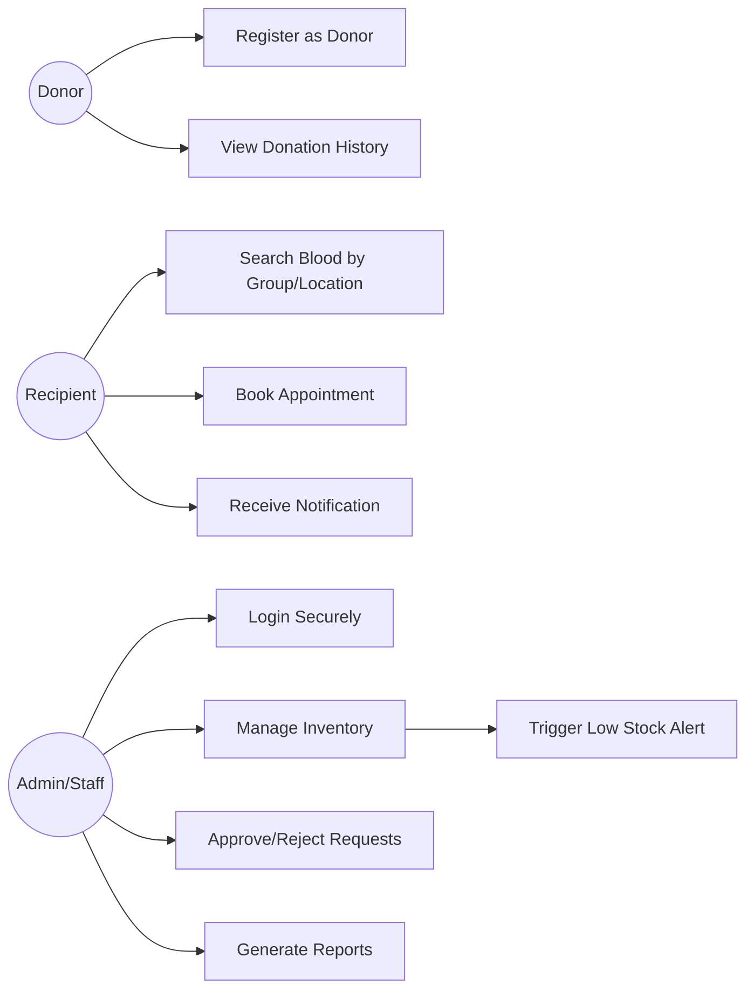
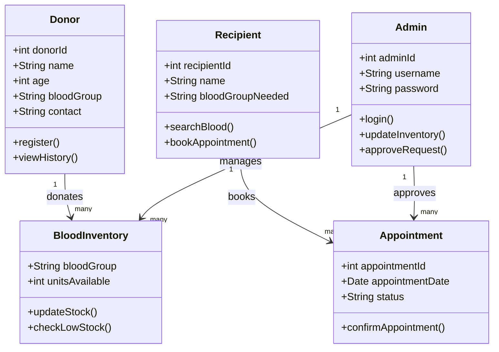
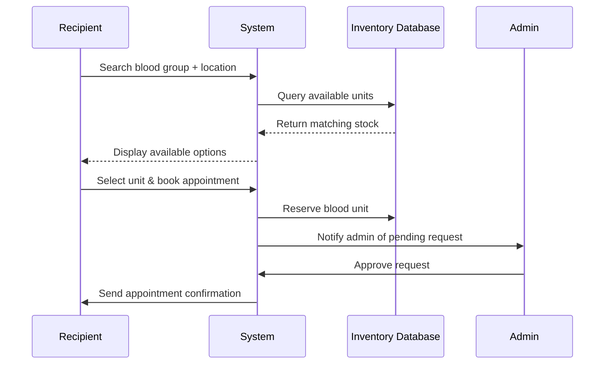
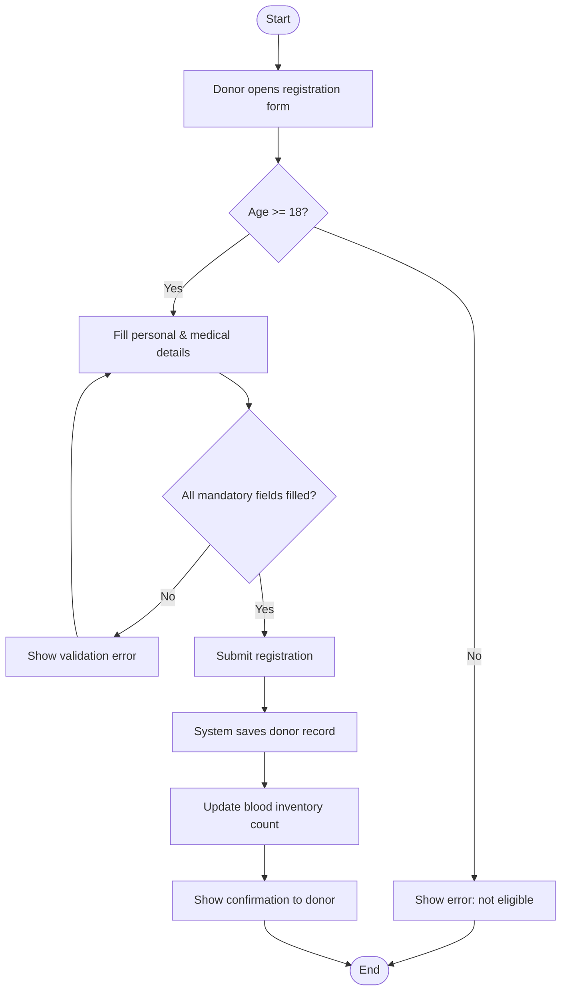

# UML Diagrams — RaktaSetu (Blood Bank Management System)

> These diagrams are written in **Mermaid** syntax, which GitHub renders automatically as visual diagrams when you view this file in the repository. No external image needed — but you can also open this in [draw.io](https://app.diagrams.net/) via the Mermaid import option if you'd like to edit them visually.

## 1. Use Case Diagram

## 2. Class Diagram

## 3. Sequence Diagram — Book Appointment (US-04)

## 4. Activity Diagram — Donation Process (US-01, US-02)

